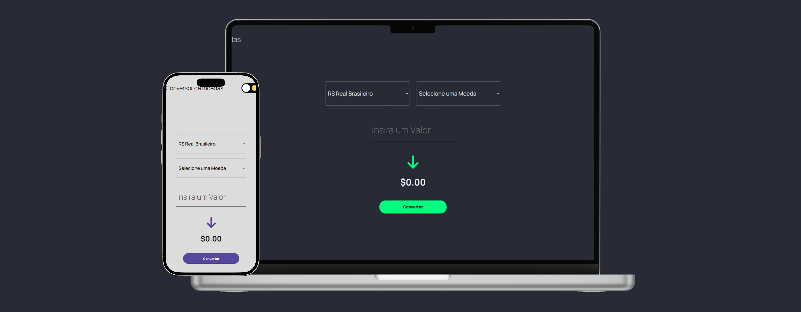

# Conversor de Moedas

Este é um projeto de conversor de moedas que permite a conversão do Real Brasileiro (BRL) para diferentes moedas estrangeiras, incluindo Dólar Americano (USD), Euro (EUR), Libra Esterlina (GBP), Iene Japonês (JPY) e Bitcoin (BTC). Os valores são atualizados em tempo real por meio da API "AwesomeAPI". **[Link do projeto](https://davirrocha.github.io/conversor/)**

## Tecnologias Utilizadas

- HTML5

- CSS3

- JavaScript (ES6+)

- API "AwesomeAPI" para cotações

- Google Fonts

- FontAwesome

## Funcionalidades

- Selecionar a moeda para conversão

- Inserir um valor em reais (BRL)

- Obter o valor convertido em tempo real

- Modo claro e escuro